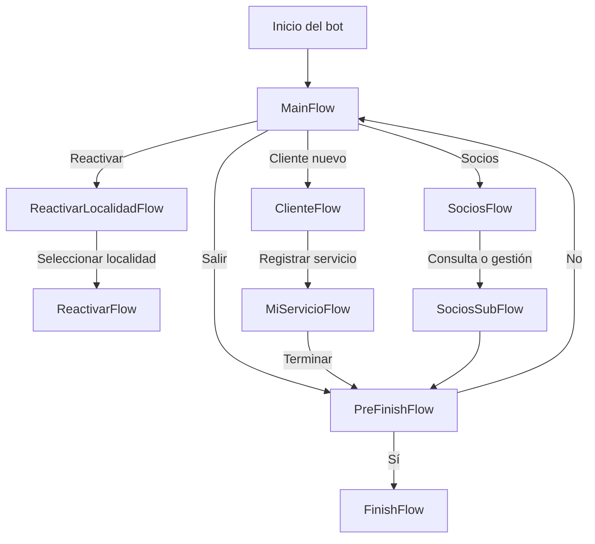

# 🧭 Descripción Detallada de Flujos

## 🟢 1. MainFlow

**Propósito:** Punto de entrada principal.  
**Funcionalidad:**

- Muestra menú principal con opciones:
  1. Cliente nuevo
  2. Reactivar servicio
  3. Socios
  4. Finalizar conversación
- Llama a los subflujos correspondientes según la opción seleccionada.

**Flujos relacionados:**

- Opción 1 → `ClienteFlow`
- Opción 2 → `ReactivarLocalidadFlow`
- Opción 3 → `SociosFlow`
- Opción 4 → `PreFinishFlow`

---

## 🟣 2. ClienteFlow

**Propósito:** Gestionar clientes nuevos.  
**Secuencia:**

1. Solicita datos básicos del cliente.
2. Pregunta si desea registrar un servicio.
   - Si el usuario responde afirmativamente → llama a `MiServicioFlow`.
   - Si no → redirige a `PreFinishFlow`.

**Funciones invocadas:**

- `utils.setEvent('CLIENTE')`
- `gotoFlow(MiServicioFlow)` o `gotoFlow(PreFinishFlow)`

---

## 🟠 3. ReactivarLocalidadFlow

**Propósito:** Permitir la reactivación de un servicio según la localidad.  
**Secuencia:**

1. Muestra lista de localidades disponibles.
2. El usuario elige una localidad (por número o nombre).
3. Se guarda la elección y se pasa a `ReactivarFlow` con el contexto.

**Funciones:**

- Obtiene las localidades de una API (`fetch`).
- Muestra la lista usando `map((loc, i) => ...)`.
- En caso de error → `gotoFlow(MainFlow)`.

**Flujo siguiente:** `ReactivarFlow`

---

## 🟡 4. ReactivarFlow

**Propósito:** Realizar la reactivación propiamente dicha.  
**Secuencia:**

1. Pide al usuario su número de socio o DNI.
2. Hace un `fetch` a la API de reactivación con los datos.
3. Devuelve mensaje de confirmación o error.
4. Luego ofrece volver al menú → `gotoFlow(MainFlow)`

---

## 🔵 5. SociosFlow

**Propósito:** Gestionar consultas o trámites de socios existentes.  
**Secuencia:**

1. Muestra menú con opciones comunes:
   - Consultar estado
   - Modificar datos
   - Solicitar baja
2. Según la elección → llama a `SociosSubFlow` para procesar cada acción.
3. Luego redirige a `PreFinishFlow`.

---

## 🔵 6. SociosSubFlow

**Propósito:** Subflujo interno de `SociosFlow`.  
**Secuencia:**

1. Ejecuta la acción seleccionada (consultar, modificar, etc.) mediante la API correspondiente.
2. Devuelve confirmación y termina con `gotoFlow(PreFinishFlow)`.

---

## 🧰 7. MiServicioFlow

**Propósito:** Gestionar el registro de servicios de un cliente nuevo.  
**Secuencia:**

1. Pide al usuario el tipo de servicio a registrar.
2. Guarda los datos en backend (`fetch` a `/servicio`).
3. Pregunta si desea registrar otro o finalizar.
   - Si elige finalizar → `gotoFlow(PreFinishFlow)`.

---

## 🔴 8. PreFinishFlow

**Propósito:** Confirmar si el usuario desea finalizar la conversación.  
**Secuencia:**

1. Pregunta: “¿Querés finalizar la conversación? (Sí / No)”
2. Si el usuario responde afirmativamente → `gotoFlow(FinishFlow)`
3. Si responde negativamente → `gotoFlow(MainFlow)`

**Corrección clave:**

```js
opt.toLocaleLowerCase().includes('si') // usar includes, no contains
```

## ⚫ 9. FinishFlow
**Propósito:** Terminar la conversación de forma amable.
**Secuencia:**
1. Envía mensaje de despedida.
2. Cierra el flujo con → `endFlow()`


## 🔄 Ejemplo de Flujo Completo
```yaml
Usuario: Hola
Bot: ¡Bienvenido! ¿Qué deseas hacer?
1️⃣ Cliente nuevo
2️⃣ Reactivar servicio
3️⃣ Socios
4️⃣ Finalizar conversación

Usuario: 1 → ClienteFlow
Bot: Ingresá tus datos básicos...
Usuario: Listo
Bot: ¿Querés registrar un servicio? (Sí / No)
Usuario: Sí → MiServicioFlow
Bot: Ingresá el tipo de servicio...
Usuario: Internet
Bot: Servicio registrado ✅
Bot: ¿Deseás finalizar la conversación? (Sí / No)
Usuario: Sí → FinishFlow
Bot: ¡Gracias por comunicarte! 👋
```

```mermaid
flowchart TD
A([Inicio del Chatbot]) --> B[Flujo Principal - Main Flow]

    %% MAIN FLOW
    B --> |Cliente nuevo| C[Flow: CLIENTE NUEVO]
    B --> |Reactivar servicio| D[Flow: REACTIVAR SERVICIO]
    B --> |Soy socio| E[Flow: SOY SOCIO]
    B --> |Menú principal| F[Flow: MENÚ PRINCIPAL]
    B --> |Finalizar| G[Flow: FINALIZAR]

    %% CLIENTE NUEVO
    C --> C1[Pregunta: 'Indica tu localidad']
    C1 --> C2{Valida localidad}
    C2 --> |Válido| C3[Pregunta: 'Indica tu dirección']
    C2 --> |Inválido| C1
    C3 --> C4[Pregunta: 'Indica tu nombre y apellido']
    C4 --> C5[Llama a API: /new-client]
    C5 --> |OK| H[Flow: PRE FINALIZAR]
    C5 --> |Error| G

    %% REACTIVAR SERVICIO
    D --> D1[Pregunta: 'Indica tu localidad']
    D1 --> D2{Valida localidad}
    D2 --> |Válido| D3[Pregunta: 'Indica tu dirección']
    D2 --> |Inválido| D1
    D3 --> D4[Pregunta: 'Indica tu nombre y apellido']
    D4 --> D5[Llama a API: /reactivar]
    D5 --> |OK| H
    D5 --> |Error| G

    %% SOY SOCIO
    E --> E1[Pregunta: 'Indica tu DNI']
    E1 --> E2[Llama a API: /getSocio]
    E2 --> |Socio válido| F
    E2 --> |No encontrado| H

    %% MENÚ PRINCIPAL
    F --> F1[Opciones: 1. Facturación 2. Soporte 3. Comercial 4. Finalizar]
    F1 --> |1| F2[Llama a API: /facturacion]
    F1 --> |2| F3[Llama a API: /soporte]
    F1 --> |3| F4[Llama a API: /comercial]
    F1 --> |4| G

    F2 --> H
    F3 --> H
    F4 --> H

    %% PRE FINALIZAR
    H --> H1[Pregunta: '¿Deseas volver al menú principal? Sí No']
    H1 --> |Sí| F
    H1 --> |No| G

    %% FINALIZAR
    G --> G1([Fin de la conversación])
````
